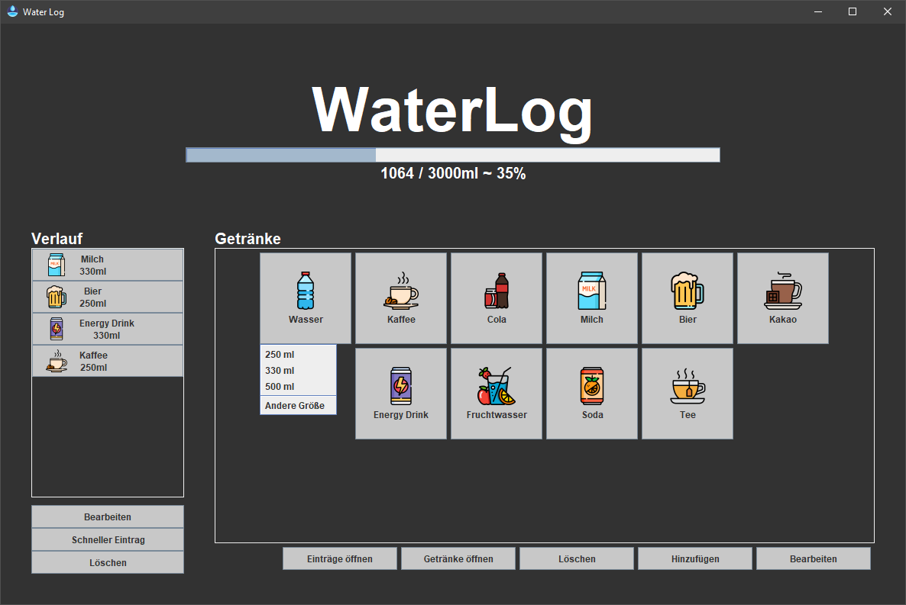

# 💧 Water Log

Water Log is a lightweight desktop application for tracking your daily fluid intake.

Create your own drinks, define their water percentage, and keep track of your hydration throughout the day.

  

---

## Features

- 🥤 Create custom drinks
- ⚡ Quick-add favorite drinks
- 💧 Adjustable water percentage per drink
- 📊 Daily hydration progress
- 💾 Automatic saving
- 🖥️ Native Windows desktop application

---

## Download

Download the latest version from the **[Releases](../../releases)** page.

---

## Installation

1. Download the latest release.
2. Extract the ZIP file.
3. Run **Water Log.exe**.

No Java installation is required.

---

## Built With

- Java 23
- Swing
- Gradle
- jpackage

---

## License

MIT License