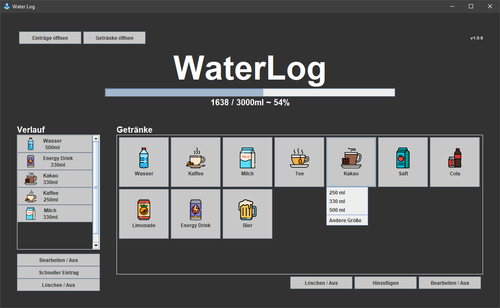
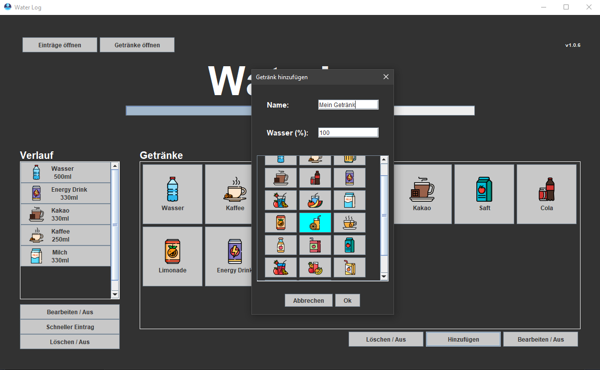

# 💧 Water Log

Water Log is a lightweight desktop application for tracking your daily fluid intake.

Create your own drinks, define their water percentage, and keep track of your hydration throughout the day.

  

  

---

## Features

- 🥤 Create custom drinks
- ⚡ Quick-add drinks
- 💧 Adjustable water percentage per drink
- 📊 Daily hydration progress
- 💾 Automatic saving

---

## Download

Download the latest version from the **[Releases](../../releases)** page.

---

## Installation

Windows:
1. Download the latest release.
2. Run **WaterLog-(version)-Windows.msi**.
3. Follow installation steps in window
4. Run **Water Log.exe**

Mac:
1. Download the latest release.
2. Run **WaterLog-(version)-macOs.dmg**
3. Navigate to installation folder and run this command in the terminal:
 *xattr -dr com.apple.quarantine "Water Log.app"* 
4. Run **Water Log.app**

Linux:
1. Download the latest release.
2. Run **WaterLog-(version)-Linux.deb**
3. Run **Water Log**

No Java installation is required.

---

## Built With

- Java 23
- Swing
- Gradle
- jpackage

---

## License

MIT License